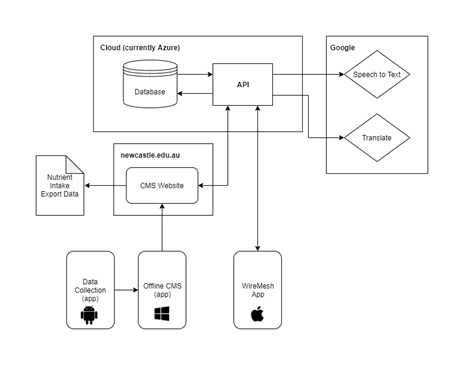

# VISIDA Project Overview
The VISIDA system is a toolkit for the collection and analysis of image-and-voice-base food records. Core functionality requires the installation and use of an Android App and Content Management System (CMS) visible in Figure 1. The CMS is further partitioned into an Angular.js web client, a .NET RESTful API, and a SQL Server.
This document give an overview of the basic steps required for installation of these core features. The software is provided as-is, and assumes a high familiarity with software development.

  
Figure 1. VISIDA system design

Installation and config details can be found inside each folder. Further details and training materials for the system are located in [documentation](documentation).

Available for use under the [MIT License](LICENSE.md)

# Content Management System
## Web Client
Files related to the web client are included in [visida_cms](visida_cms). The client is developed in [Angular.js](https://angularjs.org/), and requires Node.js to be installed.

## API
Files related to the REST API and SQL database are included in [visida_backend](visida_backend). The API is developed with AspNet .NET.

# Android App
Files related to the Android app are included in [visida_app](visida_app). This app was developed in Android Studio, which is recommended for any further updates or changes. Some documentation on updating the localization for a new region is provided in visida_app/Documents.

# Acknowledgements
The VISIDA Project would like to thank and acknowledge contributions from the following.

# The Team
**Software Development**
- Connor Dodd (connor.dodd@newcastle.edu.au)
- Josh Crompton

**Research**
- Megan Rollo
- Marc Adam
- Tracy Burrows
- Clare Collins
- Kerith Duncanson
- Shamus Smith
- Sam Stewart
- Janelle Windus

# Funding
The VISIDA Project was supported by the Bill & Melinda Gates Foundation, grant number OPP1171389.